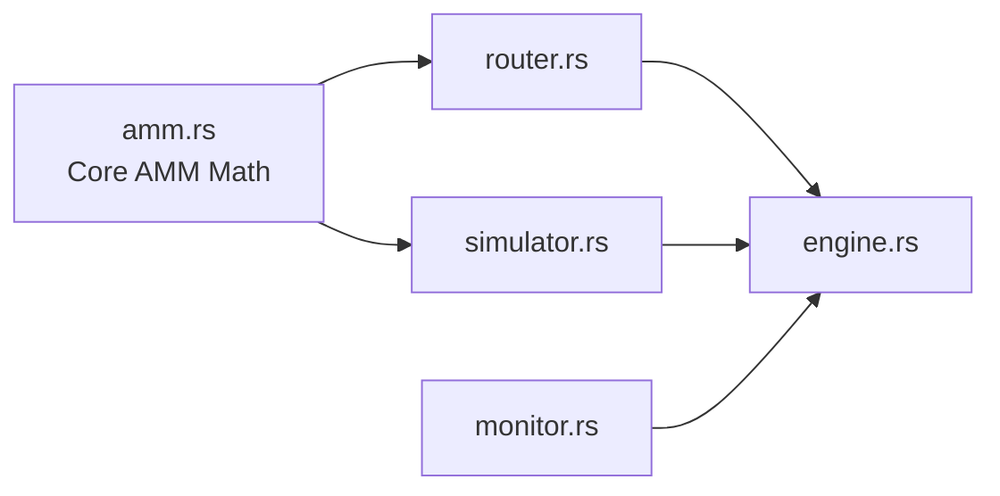

# Arb Execution Engine

A high-performance, modular execution and pricing engine for Ethereum arbitrage trading, written in Rust.

The system is designed with a strong focus on determinism, type safety, and financial safety. Core business logic is strictly separated from network interaction, while the pricing engine implements exact AMM math and routing. Signing, serialization, simulation, and execution are all predictable and verifiable, even under network failure conditions.

---

## Key Features

### Core (`arb-core`)

* **Secure Wallet Management**
  Loads keys from environment variables or encrypted keystores.
  Private keys are redacted from all debug logs and string representations.

* **Deterministic Serialization**
  Custom `CanonicalSerializer` that strictly sorts JSON keys and rejects floating point numbers to guarantee consensus-compatible encoding.

* **Strict Typing**
  Custom `TokenAmount`, `Address`, and related primitives to prevent precision loss and enforce checksum correctness.

---

### Chain (`arb-chain`)

* **Resilient RPC Client**
  Automatic retry and failover across multiple RPC providers. The client rotates immediately on errors or timeouts.

* **Fluent Transaction Builder**
  Type-safe builder for gas estimation, nonce handling, signing, and broadcasting:
  `.to().value().send_and_wait()`

* **Transaction Analyzer CLI**
  Standalone tool for dissecting Ethereum Mainnet transactions, decoding DeFi calls (ERC20, Uniswap), and summarizing gas usage and token flows.

---

### Pricing Engine (`pricing`)

* **Multi-Protocol AMM Math**
  Unified interface for Uniswap V2 (constant product) and Uniswap V3 (concentrated liquidity).
  Rust implementations exactly match Solidity integer math.

* **Graph-Based Router**
  Depth-first search (DFS) routing over AMM pool graphs to discover multi-hop paths and arbitrage cycles
  (A → B → C → A).

* **Mempool Monitor**
  WebSocket-based monitoring of pending transactions and block logs to keep pool reserves updated in near real time.

* **Fork Simulation**
  Integrated fork-based simulation using Anvil. All candidate strategies are dry-run against real Mainnet state before execution to prevent reverts and unprofitable trades.

---

### Exchange (`exchange`)

Execution-side abstraction over centralized venues. This module is responsible for market data ingestion, order management, and exchange-specific behavior while presenting a deterministic interface to the rest of the system.

* **Binance Testnet Integration**
  Connects to Binance Spot testnet for live order book snapshots and incremental depth updates.

* **Order Book Analyzer**
  Normalizes exchange depth data into internal price levels and computes spread, mid-price, and liquidity bands.

* **Programmatic Order Management**
  Places, cancels, and tracks orders through a typed client interface with explicit state transitions.

* **Exchange Configuration Layer**
  Centralized configuration for endpoints, symbols, rate limits, and authentication.

---

### Inventory & Accounting (`inventory`)

Accounting and risk layer responsible for tracking positions across venues and keeping execution inventory-balanced under arbitrage pressure.

* **Position & Balance Tracking**
  Maintains per-venue balances, open positions, and exposure by asset.

* **PnL Accounting**
  Realized and unrealized PnL tracking with explicit attribution to trades and venues.

* **Inventory Skew Detection**
  Detects asset imbalances caused by partial fills, latency, or asymmetric liquidity.

* **Rebalancing Engine**
  Generates deterministic rebalancing plans to restore target inventory ratios across exchanges.

* **Operational CLIs**

  * `inventory_dashboard`: live view of balances and exposure
  * `pnl_report`: historical and current PnL breakdown
  * `rebalancer_cli`: manual and automated rebalancing control

---

### Integration (`integration`)

End-to-end validation layer that ties pricing, exchange execution, and inventory accounting together.

* **Arbitrage Consistency Checker**
  Verifies that detected arbitrage opportunities remain profitable after execution fees, slippage, and inventory impact.

* **Cross-Module Invariants**
  Ensures balances, positions, and PnL remain internally consistent after simulated or live runs.

---

## Architecture

The system follows a strict separation between data access, pricing logic, simulation, and execution:



---

## Workspace Structure

```
arb-execution-engine/
├── core/        # Pure logic (Wallet, Types, Serialization). No network dependencies.
├── chain/       # Network logic (RPC Client, Tx Builder, Analyzer).
├── pricing/     # AMM math, routing, simulation, price impact analysis.
├── exchange/    # CEX connectivity, order books, and order execution.
├── inventory/   # Positions, balances, PnL, and rebalancing logic.
├── integration/ # End-to-end arbitrage and accounting checks.
└── .env         # Configuration (Private Keys, RPC URLs)
```

---

## Getting Started

### Prerequisites

* Rust & Cargo (v1.70+)
* Ethereum RPC URL (Alchemy, Infura, or equivalent)
* Foundry / Anvil (for Mainnet forking and simulation)
* Sepolia private key (for live integration tests)
* Binance Testnet API credentials (for exchange module testing)

---

### Installation

```bash
git clone https://github.com/yourusername/arb-execution-engine.git
cd arb-execution-engine
cp .env_example .env
```

Edit `.env` and provide:

* `PRIVATE_KEY` (no `0x` prefix)
* `RPC_URL` or `SEPOLIA_RPC`
* `BINANCE_API_KEY`
* `BINANCE_API_SECRET`

Build the workspace:

```bash
make build
```

---

## Usage

### 1. Transaction Analyzer

Analyze any Ethereum Mainnet transaction to inspect gas usage, decoded function calls, and token transfers.

```bash
make run-analyzer
```

Or manually:

```bash
cargo run -p arb-chain --bin analyzer -- <TX_HASH>
```

---

### 2. Exchange Order Book Analyzer

Streams order book data from Binance testnet and computes liquidity metrics.

```bash
cargo run -p exchange --bin book_analyzer
```

---

### 3. Inventory Dashboard

Monitor balances, positions, and inventory skew in real time.

```bash
cargo run -p inventory --bin inventory_dashboard
```

---

### 4. Local Mainnet Fork

Start a local fork for simulation and strategy testing:

```bash
./scripts/start_fork.sh
```

---

### 5. Live Integration Test (Sepolia)

Performs a full lifecycle test:

* Connects to RPC
* Checks wallet balance
* Builds and estimates a transaction
* Signs and verifies locally
* Broadcasts and waits for confirmation

```bash
make run-sepolia
```

---

## Testing Strategy

Financial correctness is enforced through layered testing:

* **Unit Tests**
  Core logic, serialization edge cases, large integer math, and routing correctness.

* **Math Verification**
  Pricing tests validate Rust AMM math against historical Mainnet transactions for exact parity with Solidity.

* **Simulation Tests**
  Fork-based integration tests execute trades against real contract bytecode.

* **Security Tests**
  Automated checks ensure private keys never appear in logs or debug output.

---

## Design Decisions

* **Integer-Only Math**
  Floating point math is banned across execution and pricing. All calculations use `U256` or normalized integer representations.

* **Simulation-First Execution**
  No transaction is broadcast unless it succeeds in a forked simulation, reducing failed gas costs and MEV exposure.

* **Core / IO Separation**
  `core` contains no network dependencies, enabling fast CI and preventing logic bugs from being masked by RPC behavior.

* **Failover by Default**
  Network instability is assumed. RPC clients rotate providers automatically without impacting signing or serialization.
